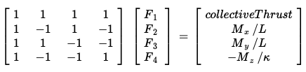

# 3-D Quadcopter Control Design #

The following describes the design and testing of a controller for a quadcopter using a cascaded controller as described in <i>Feed-Forward Parameter Identification for Precise Periodic Quadrocopter Motions</i> by Angela Schoellig et al. 

## Development Environment Setup ##

### In OS X ###

For Mac OS X, the recommended IDE is XCode.

1. Open the project from the `<simulator>/project` directory.
2. After opening project, you need to set the working directory:
  1. Go to *(Project Name)* | *Edit Scheme*
  2. In new window, under *Run/Debug* on left side, under the *Options* tab, set Working Directory to `$PROJECT_DIR` and check ‘use custom working directory’.
  3. Compile and run the project. You should see a single quadcopter.

&nbsp;

## Test Simulator ##

Import elements for the simulation.

### The Code ###

`src/QuadControl.cpp`.  This file contains all of the code for the controller.

All the configuration files for the controller and the vehicle are in the `config` directory.  All control gains and other desired tuning parameters are in a config file called `QuadControlParams.txt`.  

### The Simulator ###

In the simulator window itself, you can right click the window to select between a set of different scenarios that are designed to test the different parts of the controller.

Vehicles are created and graphs are reset whenever a scenario is loaded. When a scenario is reset (due to an end condition such as time or user pressing the ‘R’ key), the config files are all re-read and state of the simulation/vehicles/graphs is reset -- however the number/name of vehicles and displayed graphs are left untouched.

When the simulation is running, you can use the arrow keys on your keyboard to impact forces on the drone to see how the controller reacts to outside forces being applied.

#### Keyboard / Mouse Controls ####

keyboard / mouse commands

 - Left drag - rotate
 - X + left drag - pan
 - Z + left drag - zoom
 - arrow keys - apply external force
 - C - clear all graphs
 - R - reset simulation
 - Space - pause simulation

&nbsp;

## Controller Design and Test Scenarios ##

The overall design for the controller is shown in the figure below, taken from the above referenced paper by Schoellig.

### Parameter Tuning ###
The following were used for parameter tuning:

1. **Parameter Ratios**: In this [one-page document](https://www.overleaf.com/read/bgrkghpggnyc#/61023787/) the ratio of velocity proportional gain to position proportional gain for a critically damped double integrator system were derived. An important conclusion is that the ratio of `kpV / kpP` should be 4.

2. **Observing Behavior in Simulation**: The controller was developed in a process outlined below. The parameters were adjusted based on how quickly the drone approached the equillibrium position (P gain), how much the drone overshot (D gain), and ultimately how it handled drift (I gain).

3. **Peer Discussion**: Taking advantage of the experience of others.

### Scenario 1 - Stabilize Altitude ###

For scenario 1, the mass of the drone was adjusted to enable stable hovering.

### Scenario 2 - Body rate and roll/pitch control ###

First, the body rate and roll / pitch control was implemented.  The quadcopter is created with a small initial rotation speed about its roll axis.  The controller needs to stabilize the rotational motion and bring the vehicle back to level attitude.

To accomplish this:

1. Implement body rate control

 - implement the function `GenerateMotorCommands()`
 - implement the function `BodyRateControl()`
 - Tune `kpPQR` in `QuadControlParams.txt` to get the vehicle to stop spinning quickly but not overshoot

The motor commands were taken by solving the following equation for <i>F</i> after receiving the commands for collective thrust and moments. Negative signs were introduced to be consistent with coordinate system in which the <i>z</i> axis pointed downward.

Moment commands for each axis were found by solving the following

After this, the rotation of the vehicle about roll (omega.x) was controlled to 0 while other rates remained zero. 

2. Implement roll / pitch control

 - implement the function `RollPitchControl()`
 - Tune `kpBank` in `QuadControlParams.txt` to minimize settling time but avoid too much overshoot

Roll and picth commands were generated using the following formulation

Once tuned, the quad leveled itself (as shown below), though it still tends to fly away slowly since the controller is not yet controlling velocity/position. 

### Position/velocity and yaw angle control (scenario 3) ###

Next, the position, altitude and yaw controller were implemented. The simulation creates two identical quadcopters, one offset from its target point (but initialized with yaw = 0) and second offset from target point but yaw = 45 degrees. The controller required the following:

 - implement the code in the function `LateralPositionControl()`
 - implement the code in the function `AltitudeControl()`
 - tune parameters `kpPosZ` and `kpPosZ`
 - tune parameters `kpVelXY` and `kpVelZ`

 The `LateralPositionControl()` function was completed by using the following equation for a <i>PD</i> controller in <i>x</i> and <i>y</i>

At this point, the quads should be going to their destination points and tracking error should be going down. However, one quad remains rotated in yaw.

 - implement the code in the function `YawControl()`
 - tune parameters `kpYaw` and the 3rd (z) component of `kpPQR`

The yaw controller was a simple <i>P</i> controller. The yaw position control was tuned for settling time. The yaw control was not tuned too tightly, as yaw control requires a lot of control authority from a quadcopter and can significantly affect other degrees of freedom.

**Note:**  For a second order system, such as the one for this quadcopter, the velocity gain (`kpVelXY` and `kpVelZ`) should be at least ~3-4 times greater than the respective position gain (`kpPosXY` and `kpPosZ`).

### Non-idealities and robustness (scenario 4) ###

In this section, teh controller was tested for non-idealities and robustness.   IN this scenario, a configuration is presented with 3 quads that are all are trying to move one meter forward.  However, this time, these quads are all a bit different:
 - The green quad has its center of mass shifted back
 - The orange vehicle is an ideal quad
 - The red vehicle is heavier than usual

1. Implement `AltitudeControl()` to add basic integral control to help with the different-mass vehicle.

3. Tune the integral control, and other control parameters until all the quads successfully move properly.  

The results are shown below (and in the gif at the top of the page):

### Tracking trajectories ###

Once all of the pieces of the controller were working everything is put together and tested against a trajectory. 

The drones eventually follow the figure eight pattern correctly, but execute dramatic overshoot prior to settling in on the proper trajectory. This is clearly a result of the chosen gains.

### Performance Metrics ###

The specific performance metrics were as follows:

 - scenario 2
   - roll should less than 0.025 radian of nominal for 0.75 seconds (3/4 of the duration of the loop)
   - roll rate should less than 2.5 radian/sec for 0.75 seconds

 - scenario 3
   - X position of both drones should be within 0.1 meters of the target for at least 1.25 seconds
   - Quad2 yaw should be within 0.1 of the target for at least 1 second

 - scenario 4
   - position error for all 3 quads should be less than 0.1 meters for at least 1.5 seconds

 - scenario 5
   - position error of the quad should be less than 0.25 meters for at least 3 seconds

## Results ##

All requirements were met as demonstrated in the above discussion.